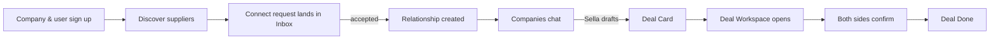
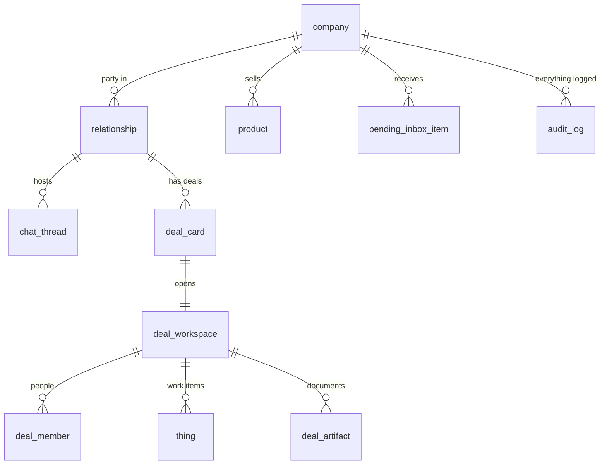
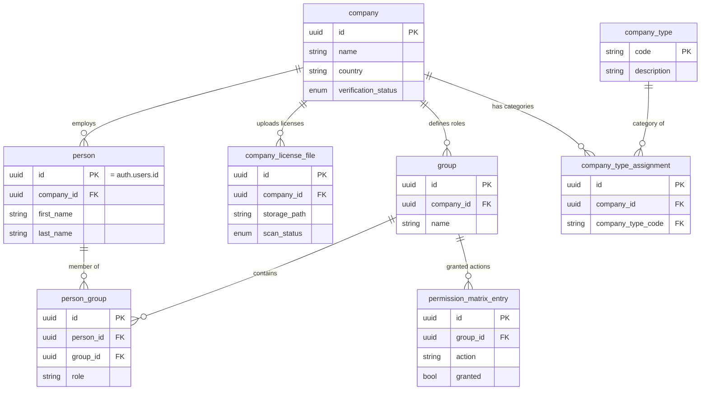
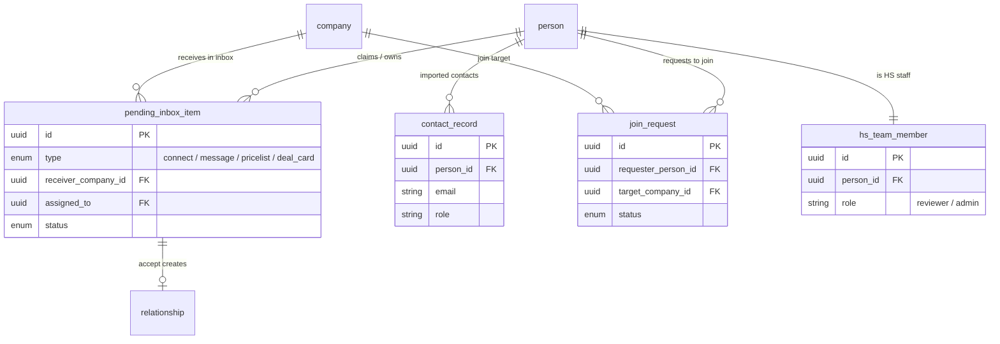
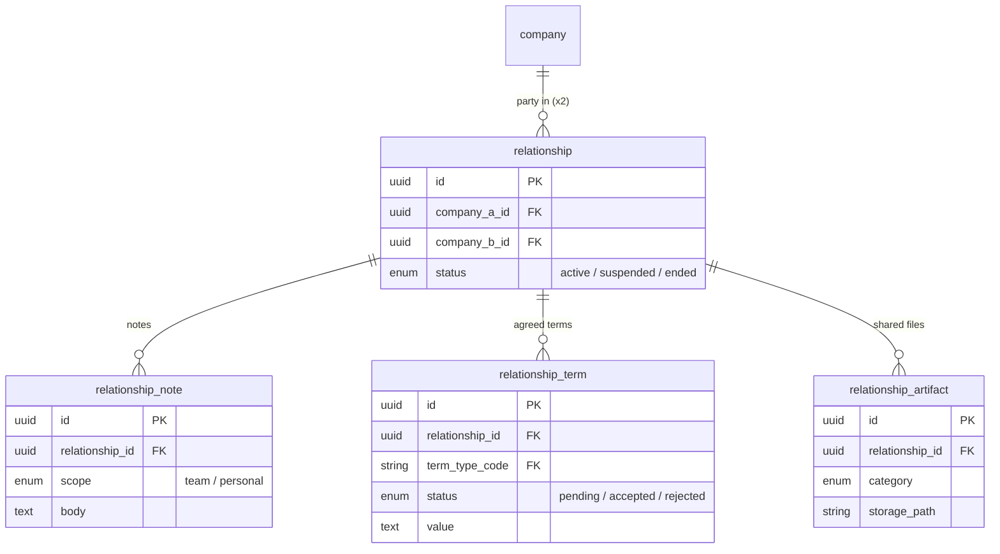
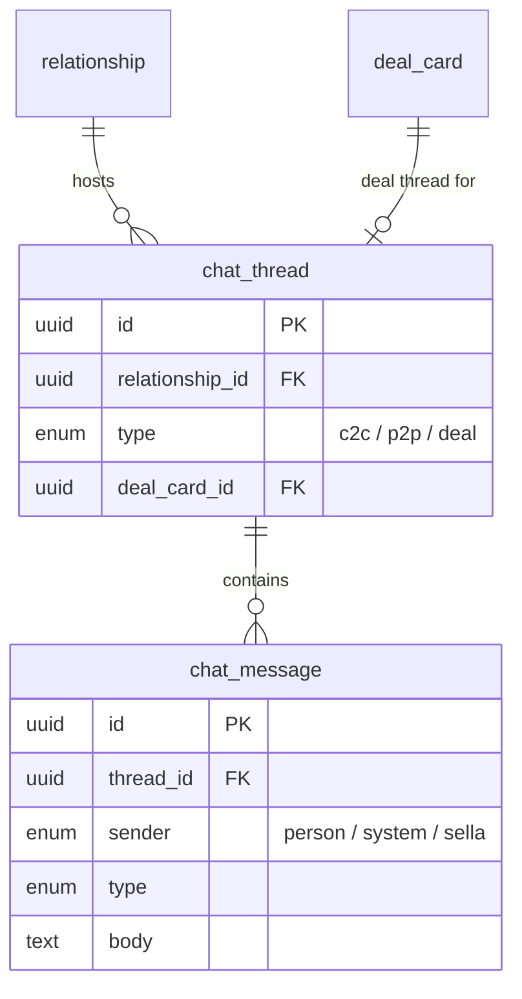
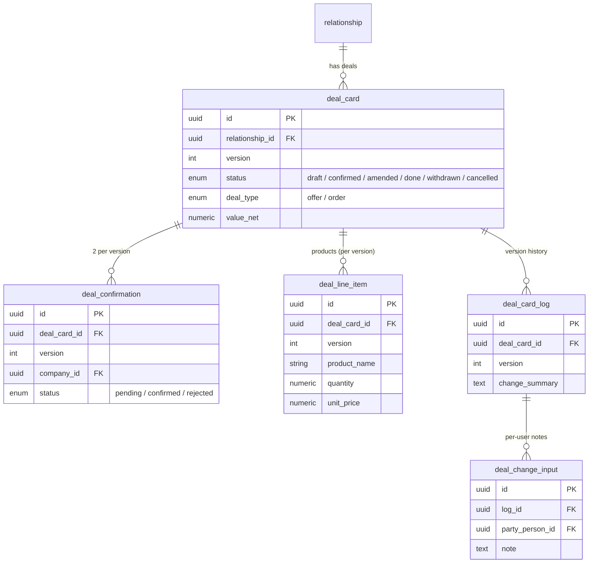
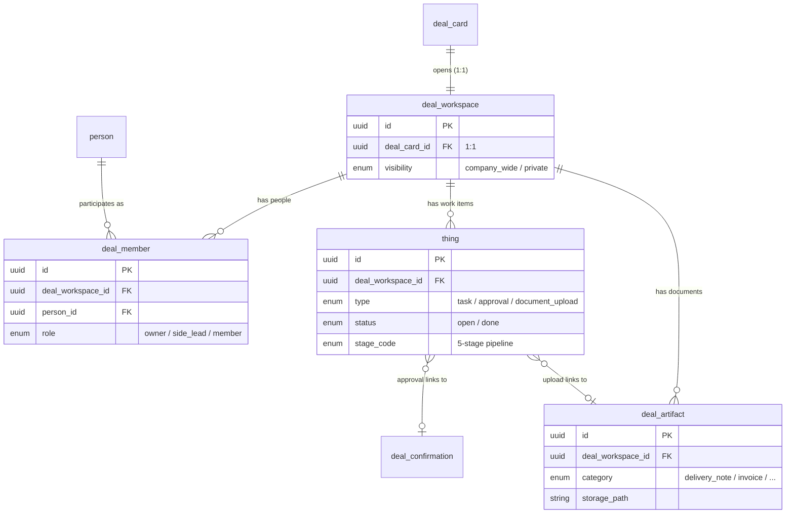
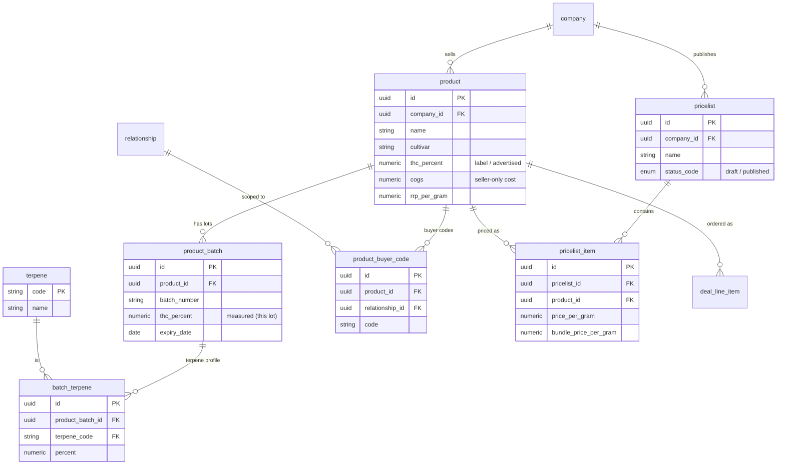
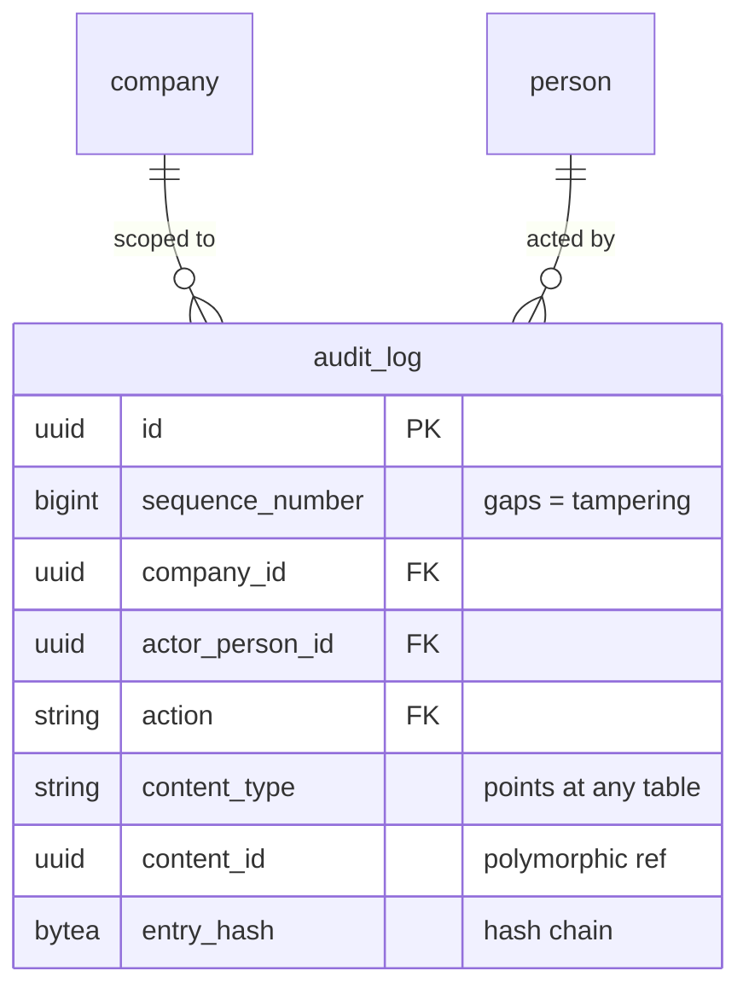

# Hello Sello — Database Schema Map

**What this is:** a visual map of every table in the database, grouped by what it does, color-coded by how finished it is.

**Source of truth for columns:** [SCHEMA-DRAFT.md](./SCHEMA-DRAFT.md). This file is the *map*; SCHEMA-DRAFT is the *detail*. When a migration changes the schema, update both.

**Last synced:** 2026-06-07 (Phase 1 + Phase 2 **built + applied** to Supabase, session 12 — incl. product catalog + pricelist + RLS).

> **Build reconciliation (session 12).** The schema is now live on Supabase (71 tables) with RLS. Two changes the build made vs the session-10 design — not yet redrawn into the diagrams below:
> - **Seller-only column split:** `product.cogs` moved to a new **`product_cost`** table; `deal_line_item.seller_margin`/`buyer_metric` moved to a new **`deal_line_item_private`** table (per-side, RLS by owner — RLS can't hide columns, so the secret numbers live in per-side siblings).
> - **13 inline "Lookup:" columns are now real lookup tables** (e.g. `chat_thread_type`, `chat_message_type`, `content_author`, `payment_terms`, `incoterms`, `note_scope`, `relationship_status`, `deal_type`, `deal_line_unit`, `deal_change_origin`, `contact_role`, `contact_provider`, `permission_action`).
>
> Column-level detail is current in [SCHEMA-DRAFT.md](./SCHEMA-DRAFT.md). RLS policy detail lives in `supabase/migrations/*_rls_policies.sql`.

---

## How to read this (for everyone, including non-engineers)

**Status colors:**

| 🟢 Locked | 🟡 In progress | 🔵 Proposed | ⚪ Deferred |
|---|---|---|---|
| Finalized, ready to build | Being designed right now | Known we need it, columns not decided | Planned for a later phase, not v0 |

**The lines between boxes** (what connects to what):

| Line | Plain English |
|---|---|
| one ──── one | each A has exactly one B (e.g. one deal → one workspace) |
| one ──< many | one A can have many B (e.g. one deal → many documents) |
| a small `o` on the line | "optional" — zero is allowed |
| a `\|` on the line | "exactly one" — required |

**A note on lookup tables:** ~20 small "controlled list" tables (statuses, categories) are kept out of the diagrams to keep them readable. They live in the [Appendix](#appendix-a--lookup--reference-tables).

---

## 1. The big picture — the deal journey

How a deal moves through the product, start to finish.

---

## 2. The whole database at a glance (the spine)

The core tables and how they hang together. Each is detailed in its own section below.

---

## 3. 🟢 Foundation — Identity &amp; Company  *(Phase 1, locked)*

**Plain English:** Who's who. Every person belongs to a company. Companies upload their licenses, define their own roles ("groups"), and set what each role is allowed to do. A company can also tag itself with business categories (cultivator, wholesaler, importer, pharmacy).

---

## 4. 🟢 Connect Inbox &amp; Onboarding  *(Phase 1, locked)*

**Plain English:** How companies first reach each other. Connection requests land in a shared **Inbox**; one person claims each. Accepting a request creates a **Relationship** (next section). Separately: imported email contacts, requests to join an existing company, and the Hello Sello staff who verify companies.

---

## 5. 🟢 Relationships  *(Phase 2, locked — Connect surface)*

**Plain English:** The lasting record of two companies being connected. It outlives any single deal and holds their shared history: notes (team or private), standing agreed terms (payment terms, incoterms…), and shared files (contracts, NDAs).

---

## 6. 🟢 Chat  *(Phase 2, locked — Connect surface)*

**Plain English:** All messaging. Three kinds of thread: **company-to-company** (one per relationship), **person-to-person** (one per pair), and **deal** (one per deal card, born when the card is drafted). System lines and Sella's suggestions are messages too — no separate table.

---

## 7. 🟢 Deal Card &amp; Agreement  *(Phase 2, locked — Connect surface)*

**Plain English:** The deal itself — the document with products, quantities and price. Every accepted change makes a new **version**; products are snapshotted per version (a regulated industry needs read-only history). Each version is gated by **two confirmations** (one per company) — both must confirm. The log records what changed; each side can attach its own note.

---

## 8. 🟢 Deal Workspace &amp; Execution  *(Phase 2, locked — Connect surface)*

**Plain English:** When a card is drafted, a workspace opens (always 1 workspace = 1 deal). It holds the **people** on the deal, the **to-do items** ("Things") grouped by the 5 deal stages, and the **documents**. One visibility flag decides whether the whole company sees it or only invited members. Uploading both a delivery note and an invoice flips a confirmed deal to *Done*.

**Ownership (2026-06-08):** a deal has **multiple owners** — both side leads at birth (each a `deal_member` with `role = owner`, one per company side), so there is **no single `owner_person_id`** on the workspace; ownership is read entirely from `deal_member`. `side_lead` / `member` are for people added later. Superadmins manage any deal via a **platform-wide RLS rule**, not a membership row.

**The 5 deal stages** (how Things are grouped across the top of the workspace):

`negotiation` → `compliance_quality` → `agreement` → `payment` → `fulfilment_delivery`

Status flips Draft → Confirmed at stage 3 (`agreement`); stages 4–5 are post-confirmation execution.

---

## 9. 🟢 Product Catalog &amp; Pricelist  *(Phase 2, locked session 10)*

**Plain English:** What a supplier sells, and for how much. The key cannabis fact: **one product has many physical batches**, and each batch is lab-tested on its own — so the *advertised* THC on the product is not the same number as the *measured* THC on each batch (that's why Marcel's CSV lists THC twice). Buyers can keep their own code for a supplier's product. v0 = **one standard company-wide pricelist** (per-customer pricing comes later).

**Two things to remember:**
- **Label vs measured:** `product.thc_percent` = advertised; `product_batch.thc_percent` = lab-measured per lot (can differ a lot). Terpene profiles vary per batch, so they're a child table (`batch_terpene`), not fixed columns.
- **Price snapshot:** when a deal is made, `deal_line_item.unit_price` is a *frozen copy* of `pricelist_item.price_per_gram` — editing the list later never rewrites past deals.

> 🔵 **Still deferred (post-v0):** per-customer / per-relationship *pricing* (the "Customer Price/g" column), multi-image galleries (`product_image`), and the DEV-41 Proposed→Applied pricelist workflow. See Appendix B.

---

## 10. 🟢 Audit  *(Phase 1, locked — cross-cutting)*

**Plain English:** One append-only logbook of every important action, across every table. It can point at *any* record (polymorphic), is **immutable** (you can't edit or delete a row), and is **tamper-evident** (each row is hash-chained to the one before, so a missing or altered row is detectable). Build rule: every business write also writes an audit row.

> `audit_log` references every other table through `content_type` + `content_id` rather than real foreign keys — that's how one table can log actions on *all* tables.

---

## Appendix A — Lookup / reference tables

Small "controlled list" tables. Pattern: store a stable `code`, translate the label (EN/DE) in the app. New values = an INSERT, not a migration.

| Lookup table | Serves | Example values |
|---|---|---|
| `company_verification_status` | company | pending · verified · rejected |
| `company_type` | company categories | cultivator · wholesaler · importer · pharmacy |
| `file_scan_status` | all file tables | pending · clean · infected · scan_error |
| `inbox_request_type` | pending_inbox_item | connect · connect_message · pricelist_request · deal_card |
| `inbox_status` | pending_inbox_item | pending · accepted · rejected |
| `join_request_status` | join_request | pending · approved · rejected · cancelled |
| `note_scope` | relationship_note | team · personal |
| `agreed_term_type` | relationship_term | payment_terms · incoterms · min_order_qty · delivery_lead_time_days · exclusivity |
| `relationship_term_status` | relationship_term | pending · accepted · rejected |
| `artifact_category` | relationship_artifact | contract · nda · certificate · marketing · other |
| `chat_message_type` | chat_message | message · deal_detected · workspace_created · deal_card_updated · … |
| `payment_terms` | deal_card | NET30 · NET60 · COD · … |
| `incoterms` | deal_card | EXW · DAP · DDP · … |
| `deal_card_status` | deal_card | draft · withdrawn · confirmed · amended · done · cancelled |
| `deal_confirmation_status` | deal_confirmation | pending · confirmed · rejected |
| `workspace_visibility` | deal_workspace | company_wide · private |
| `deal_member_role` | deal_member | owner · side_lead · member |
| `thing_type` | thing | task · approval · document_upload |
| `thing_status` | thing | open · done |
| `deal_stage` | thing | negotiation · compliance_quality · agreement · payment · fulfilment_delivery |
| `deal_artifact_category` | deal_artifact | delivery_note · invoice · proforma_invoice · contract · co_a · packing_list · certificate_of_origin · phytosanitary_cert · other |
| `product_unit` | product | g · mL · pack |
| `strain_dominance` | product | indica · sativa · hybrid · indica_dominant · sativa_dominant |
| `irradiation_type` | product | beta · gamma · un_irradiated |
| `pricelist_status` | pricelist | draft · published |
| `terpene` | batch_terpene | myrcene · limonene · beta_caryophyllene · … (23 seeds, shown as a box in §9) |
| `audit_actor_type` | audit_log | user · hs_team · sella · system · webhook |
| `audit_action_type` | audit_log | company.verify_approved · pricelist.published · … |
| `auditable_content_type` | audit_log | company · deal_card · deal_workspace · thing · … |

---

## Appendix B — Future surfaces &amp; deferred tables

No tables locked yet — here so the map shows what's coming.

| Surface / table | Status | Notes |
|---|---|---|
| **Discover** surface | ⚪ Deferred | Browse/claim suppliers (pre-populated companies, products, suggestions) |
| **Present** surface | ⚪ Deferred | Seller's shop — `deal_room` (read-only catalog view), presentation material |
| **Buy** surface | ⚪ Deferred | Buyer workspace — `basket`, `quote_request`, `purchase_order` |
| **Sell** surface | ⚪ Deferred | Seller workspace — `quote_response`, `sales_order` |
| **Grow** surface | ⚪ Deferred | Executive analytics — `deal_analytics`, `business_policy` |
| `deal_delivery` | ⚪ Phase 3 | Batch numbers, CoA files, actual delivered quantities; one deal → many deliveries. Will reference a `product_batch`. |
| `deal_room` | ⚪ Phase 3 | Present-surface customer-facing presentation view — distinct from the Deal Workspace (execution container) |
| `order` | ⚪ Phase 4 | PO#/SO#/HS# document, XML-readable for ERP |
| `analytics_event` | ⚪ Phase 2+ | UI telemetry (not audit-grade); may live in PostHog/Amplitude |
| `email_integration` | ⚪ Phase 2+ | Per (person × provider) OAuth for contact re-sync; tokens in Supabase Vault |
| `relationship_pricelist` (+ item override) | ⚪ Post-v0 | Per-customer / per-relationship **pricing** (the "Customer Price/g" column) — v0 has one standard list only |
| `product_image` | ⚪ Post-v0 | Multi-image galleries per product; v0 uses single `product.image_path` |
| DEV-41 pricelist workflow | ⚪ Post-v0 | Proposed → Applied approval flow for pricelist changes |

---

*Living document. Update alongside each migration (same commit as the `.sql`).*
