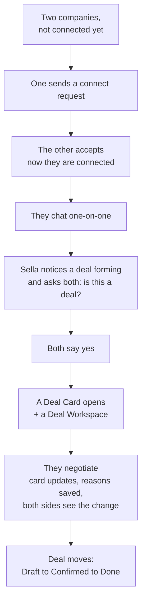
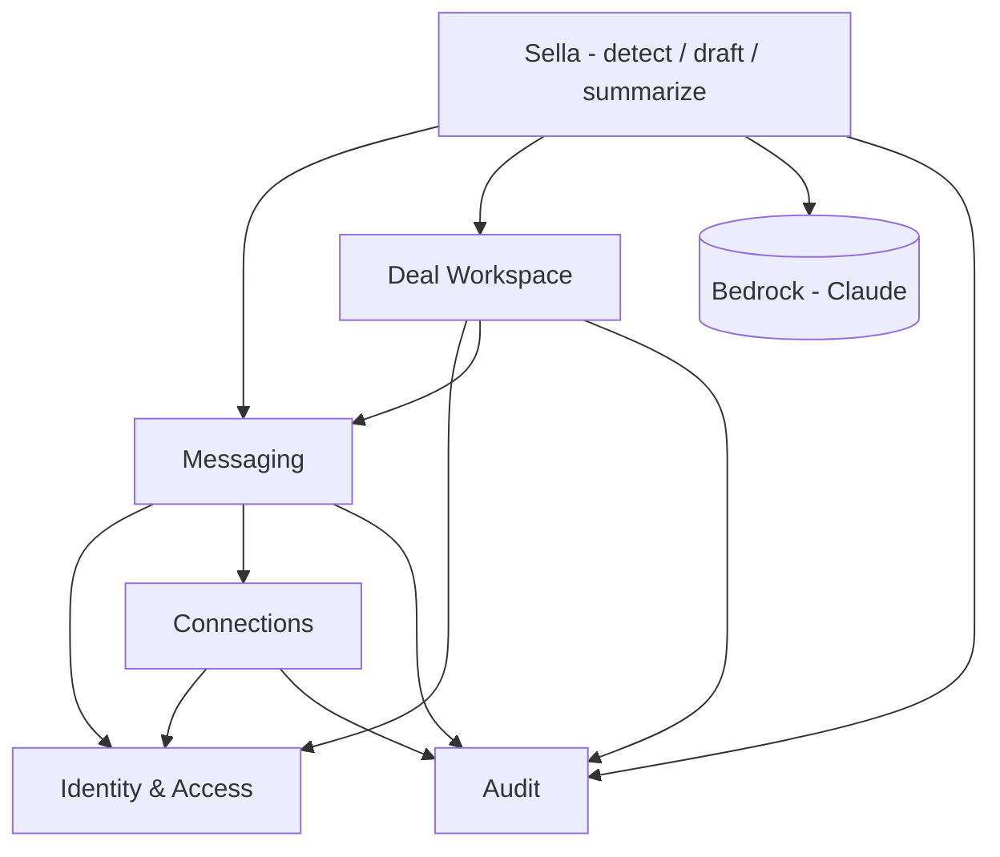

# Connect Demo - Architecture

**Status:** Shared. This is the **June 11 Connect-demo slice** - a simplified cut of the full product, not new canon. The full rules live in the canon (`CONTEXT.md`, `../decisions/DECISIONS.md`, `SCHEMA-DRAFT.md`); this doc references them and does not re-decide anything.
**Style:** Modular monolith (lite), domain-partitioned - one app, clean inside modules. Next.js / Vercel / Supabase (Postgres). AI = Claude on AWS Bedrock (EU / Frankfurt). See the repo-structure section in the root [README.md](../../README.md).

---

## Diagrams

Three views of the same demo - pick the one for your audience. (SVGs render best opened directly; the Mermaid versions below render inline on GitHub.)

| Diagram | For whom | What it shows |
|---|---|---|
| [engineering-architecture.svg](diagrams/engineering-architecture.svg) | builders | the 6 components, the one app, and what it sits on (Auth, Postgres, Bedrock) |
| [runtime-sequence.svg](diagrams/runtime-sequence.svg) | builders | the deal flow over time - message in → Sella drafts the card → writes to Postgres → Done |
| [business-architecture.svg](diagrams/business-architecture.svg) | the room (non-tech) | the simple journey: connect → chat → Sella spots the deal → confirm → done |

---

## The 6 building blocks

| # | Block | What it does (plain words) |
|---|---|---|
| 1 | **Identity & Access** | Knows who the user is and which company they belong to. Keeps each company's data private. |
| 2 | **Connections** | Lets two companies connect: one sends a request, the other accepts. *Demo = simple handshake. Future = First-contact Sella greets and screens the new contact.* |
| 3 | **Messaging** | The chat. One-on-one chats and the deal chat. Stores the threads and messages. |
| 4 | **Deal Workspace** | The deal card, its versions, its life (Draft → Confirmed → Done), and the workspace that is born with the card. The price sits on the card. |
| 5 | **Sella (AI)** | Three jobs: spot a deal forming in chat, draft the deal card, write summaries. Suggests only - never sends on its own. *(This is **Deal-Sella** in the canon's multi-Sella family.)* |
| 6 | **Audit** | A permanent record of every change, including Sella's. |

---

## Diagram 1 - User flow (inline)

The journey, in plain words. Who shows up, and what happens.

---

## Diagram 2 - Engineering (inline)

The 6 blocks and what depends on what. An arrow means "needs / reads from."

---

## What we are NOT building for the demo (on purpose)

- **Pricelist management** - the price just lives on the deal card, taken from the chat. (Pricelists are canon Phase 2.)
- **Full First-contact Sella intake** - connection is a simple handshake for now. (The AI receptionist is a fast-follow.)
- **Things, the full multi-Sella specialists, and the other surfaces** (Buy / Sell / Grow / Discover) - later.

---

## Key things to remember

- **Sella is a leaf** - nothing depends on it. If the AI is slow or down, chat and deals still work.
- **Privacy by build, not by promise** - each company sees only its own data (filtered by `company_id`). One deal cannot leak into another (filtered by `deal_id`).
- **The 6 blocks become the 6 code folders.**

---

*This is the demo slice. When Buy / Sell / Grow / Discover arrive later, we re-run the same method: some add new blocks (e.g. Pricelist with Sell), most reuse these 6.*
